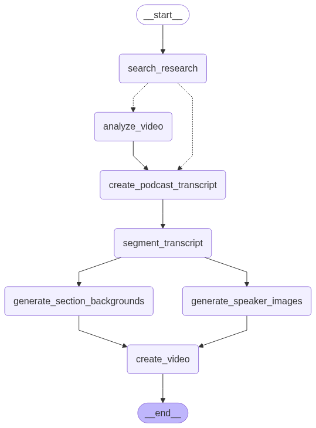

# Multi-Modal Researcher Agent

An AI-driven research and content generation system that transforms any topic into engaging podcast-style video content. Using Google's Gemini AI models, this agent performs comprehensive research, analyzes multimedia content, and creates professional podcast videos with synthesized audio, AI-generated speaker images, and dynamic backgrounds.

## Architecture

The system follows a LangGraph-based workflow 



1. **Research Phase**: Web search and optional video analysis
2. **Content Creation**: Podcast script generation and intelligent segmentation
3. **Media Generation**: Speaker images and background creation
4. **Video Production**: TTS audio generation and final video assembly


## Features

### Core Capabilities
- **Multi-Modal Research**: Combines web search and YouTube video analysis for comprehensive topic coverage
- **Intelligent Content Synthesis**: Merge insights from multiple sources
- **Podcast Generation**: Creates natural, engaging conversations between AI speakers (Dr. Lisa & Mike)
- **Video Production**: Generates complete videos with:
  - Text-to-speech audio with distinct voices
  - AI-generated speaker portraits
  - Thematic background images

### AI-Powered Workflow
- **LangGraph Integration**: Orchestrates complex multi-step workflows
- **LangSmith Tracing**: Built-in observability and debugging
- **Configurable Models**: Flexible model selection for different tasks
- **Intelligent Segmentation**: Automatic content analysis and thematic organization


## Installation

1. **Clone the repository**:
   ```bash
   git clone <repository-url>
   cd multi-modal-researcher-agent
   ```

2. **Create and activate virtual environment**:
   ```bash
   uv venv
   source .venv/bin/activate  
   ```

3. **Install dependencies**:
   ```bash
   uv pip install -e .
   ```

4. **Set up environment variables**:
   Create a `.env` file in the project root:
   ```env
   GEMINI_API_KEY=your_gemini_api_key
   LANGSMITH_API_KEY=your_langsmith_api_key  # Optional
   LANGSMITH_PROJECT=your_project_name       # Optional
   ```

## Quick Start

### Using LangGraph Server (Recommended)

Start the development server:
```bash
uvx --refresh --from "langgraph-cli[inmem]" --with-editable . --python 3.11 langgraph dev --allow-blocking
```

### Direct Python Usage

```python
cd src/agent && uv run graph.py 
```

## Configuration

The system supports extensive configuration through the `Configuration` class:

### Model Settings
- `search_model`: Model for web search (default: "gemini-2.5-flash")
- `synthesis_model`: Model for content synthesis (default: "gemini-2.5-flash")
- `video_model`: Model for video analysis (default: "gemini-2.5-flash")
- `tts_model`: Model for text-to-speech (default: "gemini-2.5-flash-preview-tts")
- `image_model`: Model for image generation (default: "gemini-2.0-flash-preview-image-generation")

### Audio Settings
- `mike_voice`: Voice for Mike speaker (default: "Puck")
- `lisa_voice`: Voice for Dr. Lisa speaker (default: "Kore")
- `tts_channel`: Audio channels (default: 1)
- `tts_rate`: Sample rate (default: 24000)

### Temperature Controls
- `search_temperature`: Factual search (default: 0.0)
- `synthesis_temperature`: Balanced synthesis (default: 0.3)
- `podcast_temperature`: Creative dialogue (default: 0.4)

## 📁 Project Structure

```
multi-modal-researcher-agent/
├── src/agent/
│   ├── audios.py          # Audio/video generation utilities
│   ├── configuration.py   # Configuration management
│   ├── graph.py           # Main LangGraph workflow
│   ├── state.py           # State definitions
│   └── utils.py           # Core utilities and helpers
├── podcast/               # Generated content output
│   ├── images/
│   │   ├── speakers/      # AI-generated speaker images
│   │   └── backgrounds/   # Section background images
│   └── script.txt         # Generated podcast script
├── pyproject.toml         # Project configuration
├── langgraph.json         # LangGraph server configuration
└── README.md
```


## Acknowledgments

- **Google Gemini**: For powerful multi-modal AI capabilities
- **LangGraph**: For workflow orchestration
- **LangSmith**: For observability and debugging
- **MoviePy**: For video processing capabilities
- **Lance from LangChain**: Excellent video by Lance https://www.youtube.com/watch?v=6Ww5uyS0tXw&t=65s. I simply extend work a little more.
 
